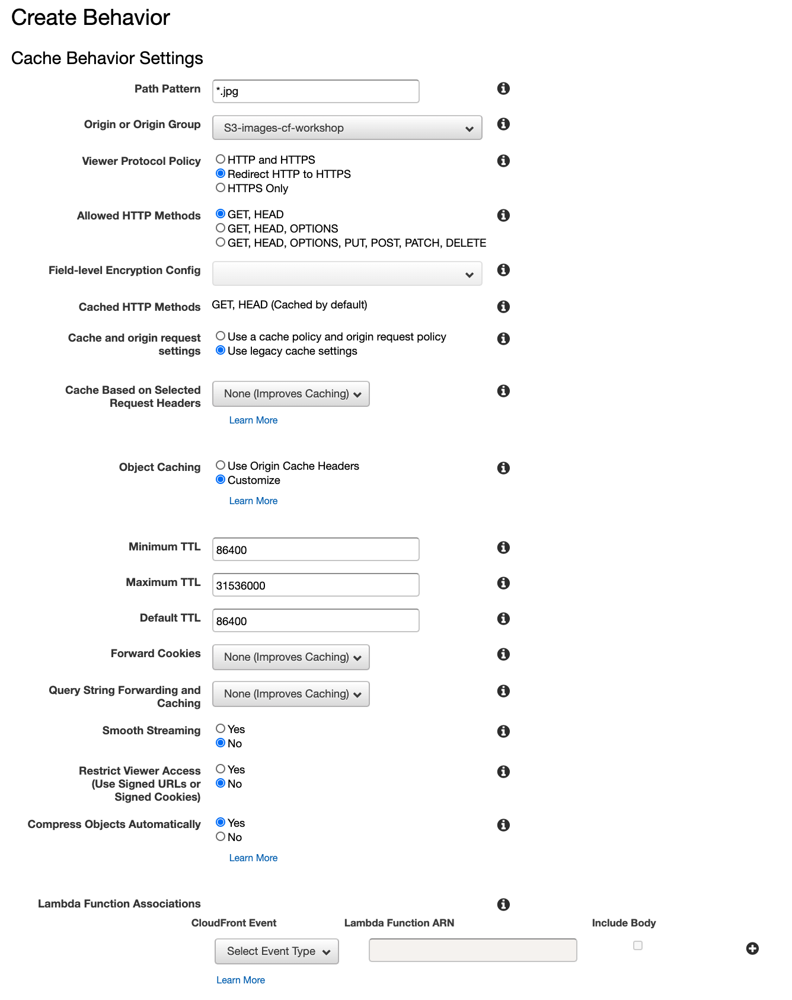
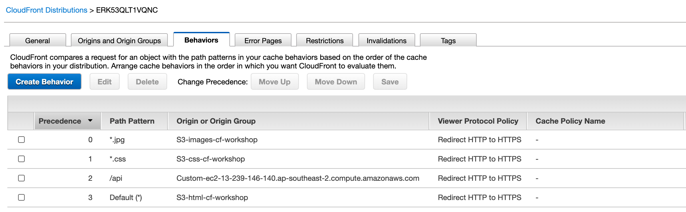

## Multi Origin CloudFront Distribution

- Change directory to 1-distribution-with-origins

```$ cd 1-distribution-with-origins```

- Create a EC2 Key Pair in AWS region where you want to run this workshop.

- Update WORKSHOP_NAME and KEY_PAIR in the _vars.env_ file

- Run the following to set the environment variables. 

```
$ source vars.env
```

- Update the image id (ImageId) of EC2 Resource in the Cloud formation template cloudfront-lab.yaml. 
  - e.g. ImageId: ami-xxxxxxxxx

- Deploy Cloudformation stack which creates an EC2 instance and a S3 bucket

```
$ ./deploy.sh deploy
```

- CloudFormation stack created in previous step will create the following resoruces
  - EC2 instance
  - 2 html S3 buckets
  - 1 images S3 bucket
  - 1 css S3 bucket
  - 1 security group
 
- ssh into EC2 instance with the keypair that you created and used in _vars.env_  e.g.
 
```
From your local terminal

$ ssh -i <keypair.pem> ec2-user@<ec2-ip-address>
```

- check if nodejs is already installed on your EC2
```$ node --version
   $ npm --version
```
- If node is not installed, Install nodejs (follow instructions provided in the following url)

https://docs.aws.amazon.com/sdk-for-javascript/v2/developer-guide/setting-up-node-on-ec2-instance.html

- check if git is already installed

``` $ git --version ```

- If git is not already installed, install git using the following

```
$ sudo yum install git
```

- Clone this git repo in your ec2 instance as we are going to create nodejs api in the EC2 instance

```
$ git clone https://github.com/vikasbajaj/cloudfront-workshop.git
```
- Once repo is cloned, go to repo folder and into scenario-1 folder and run npm install

```
$ cd cloudfront-workshop
$ cd 1-distribution-with-multiple-origins/app
$ npm install
```

- we are running express server on port 3000, however we will map port 80 with 3000. Run the following command on EC2 ssh terminal
```
sudo iptables -t nat -A PREROUTING -i eth0 -p tcp --dport 80 -j REDIRECT --to-port 3000
```

- Run the node application
```
$ nohup node app.js > /dev/null 2>&1 &

  - nohup means: Do not terminate this process even when the stty is cut off
  - > /dev/null means: stdout goes to /dev/null (which is a dummy device that does not record any output)
  - 2>&1 means: stderr also goes to the stdout (which is already redirected to /dev/null) You may replace &1 with a file path to keep a log of errors, e.g.: 2>/tmp/myLog
  - & at the end means: run this command as a background task
```

- Try to access your node application from your browser

```
1. http://<ec2-public-dns-name>/api


2. http://<ec2-public-dns-name>/apireqheaders
  
  Response from /apiheaders should show request headers
  
  {"host":"ec2-52-64-19-84.ap-southeast-2.compute.amazonaws.com","user-agent":"Mozilla/5.0 (Macintosh; Intel Mac OS X 10.14; rv:68.0) Gecko/20100101   
  Firefox/68.0","accept":"text/html,application/xhtml+xml,application/xml;q=0.9,*/*;q=0.8","accept-language":"en-US,en;q=0.5","accept-encoding":"gzip,    
  deflate","connection":"keep-alive","upgrade-insecure-requests":"1","if-none-match":"W/\"184-wK/uqnBA+E314L6P7EtixEigC+E\""}
  
3. http://<ec2-public-dns-name>/apiquerystring?test=val1&test2=val2
  
  Response from apiquerystring should have you query string parameters 
  
  {"test":"val1","test2":"val2"}
```

- In case you want to delete the process created by node, use the following
```
$ lsof -i TCP:3000

$ kill -9 PID_TO_KILL
```
## CloudFront Distribution

### Create Distribution with default Origin
<hr>

- Go to CloudFront console and select **html-cf-workshop.s3.amazonaws.com** S3 rest endpoint for default origin


### Once you create the distribution, it takes time to deploy the configuration across Edge Locations
<hr>


### Create another origin for IMAGE files, any images that are used in index.html will be served from this Origin
<hr>

- select "images-cf-workshop" S3 rest endpoint for Images origin 


### Create another origin for CSS files, any CSS files that are used in index.html will be served from this Origin
<hr>

- select "css-cf-workshop" S3 rest endpoint for default origin


### Navigate to the CloudFormation console and click on Outputs tab of the CloudFormation that we created earlier and copy EC2 DNS Endpoint, which will used to create a Custom Origin in the next step
<hr>


### Create another origin, this time it's a Custom Origin pointing to EC2 instance where we are running api (/api*) as a Node server
<hr>


### List of Origins, 1 Default origin which got created while Distribution creation and 3 additional origins (2 pointing to S3 rest endpoint and 1 custom origin)
<hr>


### Create a Behaviour for Path Pattern *.jpg, pointing to Image Origin that we created in the previous steps. Any *.jpg request will be taken care by this behaviour
<hr>


### Create a Behaviour for Path Pattern *.css, pointing to CSS Origin that we created in the previous steps. Any *.css request will be taken care by this behaviour

<hr>


### Create a Behaviour for Path Pattern /api*, pointing to Custom Oiring (EC2) that we created in the previous steps. Any /api* request will be taken care by this behaviour
<hr>


### List of all behaviours that you have created
<hr>



<hr>

- Once distrubution is deployed across edge locations, status will be "deployed"


<hr>

### Let's test it
<hr>

- Click on your Distribution and copy "Domain Name: xxxxxxxxxxxxxxx"


- Access your application from your browser using http://d2q7xolzbmqu67.cloudfront.net. [replace d2q7xolzbmqu67.cloudfront.net with your domain name]

- you should see default root object which is **index.html** coming from html s3 bucket origin (html-cf-workshop-vb), api result is served from Custom EC2 origin, style sheet is served from css s3 bucket origin (css-cf-workshop-vb) and cloudfront.jpg image coming from image s3 bucket image (images-cf-workshop-vb).

```
http://d2q7xolzbmqu67.cloudfront.net
```


### Observations

- Look at the request headers in the /api* response. There are quite a few headers appended by CloudFront before forwarding the request to /api*
  - x-amz-cf-id
  - cloudfront-is-desktop-viewer
  - cloudfront-viewer-country
  - cloudfront-forwarded-proto

- Open developers tool in your browser and look at the Response Headers for all the resources that have been delivered to your browser (css, html, images, api) 
  - x-cache
  - x-amz-cf-pop
  - x-amz-cf-id

  #### Refresh your page few times and then observe changes in the following response headers in the developers tool for all the resources (css, html, images, api)
  - x-cache
  - x-amz-cf-pop
  - x-amz-cf-id

### Next Steps - Try Invalidating cached objects in your distribution
<hr>

- make changes in the index.html file and upload it to html S3 bucket and try to refresh the browser.

- Notice **x-cache** response header in the developers tool: it should be **Hit from cloudfront** because your configured html pages to be cached on the edge with minimum TTL of 86400

- Let's invalidate the cache. Navigate to your CloudFront distribution, click your distribution and to to **Invalidations** tab. click on "Create Invalidation", enter / (i.e. forward slash) and click "Invalidate".

- Wait for Invalidation to be completed, it will take few minutes.

- Notice **x-cache** response header in the developers tool: it should display **Miss from cloudfront** for **index.html**

### Next Steps - Configure Custom Error Page for 403: Forbidden
<hr>

- Test to access a resource that doesn't exist in your distribution

- try **http://distribution domain name/doyouexist**, you will get **403 Forbidden** response from CloudFront as the resourcem, you are trying to access doesn't exist.

- Let's configure custom error page to handle the error gracefully.

- Select your distribution and click **Error Pages** tab, click on **Create Custom Error Response**, select the following
  - HTTP Error code: 403: Forbidden
  - Customize Error Response: Yes
  - Respose Page Path: /403.html
  - Error Caching Minimum TTL (seconds): 5
  - HTTP Response Code: 200: OK

- Now, try to access **http://distribution-domain-name/random**


### Next Steps - Configure Origin Group

In this section, you will configure an origin group to provide rerouting during a failover event. You can associate an origin group with a cache behavior to have requests routed from a primary origin to a secondary origin for failover.

- click on your distribution, click on **Origins and Origin Groups**
- click **Create Origin**
- select **html-secondary-cf-workshop-vb** S3 rest endpoint for Origin Group secondary origin


#### Create Origin Origin
- on the **Origins and Origin Groups** page, click **Create Origin Group**
- From the list of origins, select **html-cf-workshop** Origin and click on **Add**
- Add second origin (failover origin) From the list of origins, select **html-secondary-workshop" Origin and click on **Add**
- Select **404 Not Found** under Failover criteria
- click **Create**


- Go to **Behaviours** tab and select the **Default** (Path Pattern - Default (*)) behaviour and click **Edit**
- On the Behaviour edit page, select newly created "Origin Group" origin in the **Origin or Origin Group** drop down.


- click "Yes, Edit". Let the changes deployed
- Once distributed is enabled and deployed, try to access **http://distribution-domain-name/index-secondary.html**
- **index-secondary.html** doesn't exist in the **html-cf-workshop** origin hence request will be routed to **html-secondary-cf-workshop** Origin as part of Origin Group configuration.


