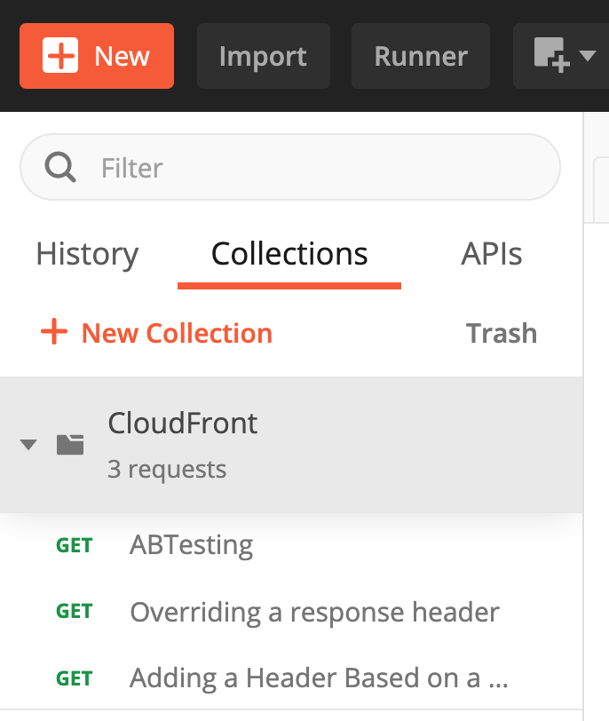

## Lambda@Edge Lab with different examples

Lambda@Edge lets you run Node.js and Python Lambda functions to customize content that CloudFront delivers, executing the functions in AWS locations closer to the viewer. The functions run in response to CloudFront events, without provisioning or managing servers. You can use Lambda functions to change CloudFront requests and responses at the following points:

- After CloudFront receives a request from a viewer (viewer request)
    - Invoked on every request. So take cost into consideration when using these triggers.
    - Can change or add request attributes which can modify the cache key :  URL, cookies, headers, query string
    - Can make network calls (useful for use cases such as stateful authentication)
    - Can generate responses that won’t be cached.
- Before CloudFront forwards the request to the origin (origin request)
    - If the cache behavior is configured for dynamic content acceleration, this will be invoked on all requests (Forward all headers).
    - Can modify request attributes before requests are sent to the origin server.
    - Access to the request that is sent to the origin,
    - Access to origin configurations (SSL protocol, timeout values, origin domain) 
- After CloudFront receives the response from the origin (origin response)
    - Invokes only when a response is sent from the origin.
    - The output of the function is cached in CloudFront if the cache behavior is configured to do so
    - Can add/modify response headers, i.e. add cache control headers
    - Can make network calls
    - Can replace the body, but currently you can’t manipulate the body of the response.
- Before CloudFront forwards the response to the viewer (viewer response)
    - Can add/modify response headers, i.e. add security headers

## Some of the examples for Lambda@Edge

- To change the headers at the request and response time.

- Add cookies details to the headers. Carry out AB testing based on the request and response.

- Redirect the URL to another site, based on the header details.

- We can fetch the user-agent from the headers and find out the details of the browser, OS, etc.


## Let's start playing with Lambda@Edge

- On your local workstation, go to 2-Lambda-at-Edge directory

``` $ cd  2-lambda-at-Edge ```

- Set required environment variables **WORKSHOP_NAME** and **KEY_PAIR**, run the following to set the environment variables

``` $ source vars.env```

- deploy Cloudformation stack to deploy Lambda functions

``` $ ./deploy.sh deploy ```

this will deploy all the lambda functions from directory **LambdaFunctions** in AWS **us-east-1** region because to use **Lambda@Edge** your Lambda function must be deployed in AWS **us-east-1** region.

## We will use **Postman** to send HTTP requests to test Lambda@Edge
- Have Postman configured on your laptop
- Open Postman, click "Collections" and click "Import", click Upload Files and select **CloudFront.postman_collection.json**  from **2-lambda-at-Edge/postman-lambda@edge-testharness**




## Lambda@Edge Examples
- Navigate to Lambda console and click functions
- Click on **Preferences** and select **Show replica functions**

### A/B Testing: 
- This is an example for **Viewer Request**
- Purpose: Test two different versions of an image without creating redirects or changing the URL.
- Description: This example reads the cookies in the viewer request and modifies the request URL accordingly. If the viewer doesn’t send a cookie with one of the expected values, the example randomly assigns the viewer to one of the URLs.
- [A/B Testing](LambdaFunctions/ABTesting.py)
- Configuration: associate Lambda with **Viewer Request** for behaviour which has path-pattern = *.jpg

#### Steps Required
- navigate to **Lambda** console in **us-east-1** AWS region as CloudFormation stack that you deployed in the previous step, deployed all the Lambda functions in the **us-east-1** region. Lambda@Egde requires Lambda functions to be deployed in **us-east-1** region.
- select function **abtesting**
- change **Timeout** to **5 secs** in the Basic Settings (Lambda@Edge configured for Viewer Reuest event cannot have timeout more than 5 seconds).
- select **+ Add trigger**
- select **CloudFront** and click **Deploy to Lambda@Edge**
- select the following in the pop-up window
    - your CloudFront Distribution
    - Cache Behaviour: *.jpg
    - CloudFront Event: **Viewer request**
    - Confirm deploy to Lambda@Egdge
- You function is being deployed to Edge locations depending on your CloudFormation configuration.
- You will see a function **us-east-1:abstesting:verion (Replca)** in your console. You can see replica functions in other AWS regions.
- You CloudFront distribution will move to **In Progress** state for a some time as it is deploying Lambda function on egde locations. Once it changes to **Deployed**, we are ready to test A/B Testing function.
- Go to you CloudFront distribution and click on **Behaviours**, select *.jpg behaviour and click Edit. Scroll up, you will see Lambda@Edge configured for Viewer Request (it is just a verification step). Click Cancel

#### Test Lambda@Edge
- In Postman collection that you imported, click on **ABTesting**
- click **Headers** and notice **Cookie** header, it's value is **X-Experiment-Name=B**
- change Request URL: replace distribution domain name with your distribution name.


- click **Send**, you should see **Experiment B Image**


- Change Cookie value to **X-Experiment-Name=A**


- click **Send**, you should see **Experiment A Image**


#### Clean up
- In your CloudFront distribution, select *.jpg behaviour and click edit and remove Lambda@Edge that's associated with **Viewer Request** and click save.

<hr>

### Adding Headers Based on Query String: 
- This is an example for **Origin Request**
- Purpose: Replace query string parameters with request headers.
- Description: This example shows how to get the key-value pair of a query string parameter, and then add a header based on those values. When a request contains a query string key-value pair but the origin server expects the value in a header, you can use this Lambda function to convert the key-value pair to a header
- [Adding Headers Based on Query String](LambdaFunctions/AddingHeaderBasedOnQueryString.py)
- Configuration: associate Lambda with **Origin request** for behaviour which has path-pattern = /api*

#### Steps Required
- navigate to **Lambda** console in **us-east-1** AWS region as CloudFormation stack that you deployed in the previous step, deployed all the Lambda functions in the **us-east-1** region. Lambda@Egde requires Lambda functions to be deployed in **us-east-1** region.
- select function **addingheaderbasedonquerystring**
- select **+ Add trigger**
- select **CloudFront** and click **Deploy to Lambda@Edge**
- select the following in the pop-up window
    - your CloudFront Distribution
    - Cache Behaviour: /api*
    - CloudFront Event: **Origin request**
    - Confirm deploy to Lambda@Egdge
- You function is being deployed to Edge locations depending on your CloudFormation configuration.
- You will see a function **us-east-1:addingheaderbasedonquerystring:verion (Replca)** in your console. You can see replica functions in other AWS regions.
- You CloudFront distribution will move to **In Progress** state for a some time as it is deploying Lambda function on egde locations. Once it changes to **Deployed**, we are ready to test A/B Testing function.
- Go to you CloudFront distribution and click on **Behaviours**, select **/api*** behaviour and click Edit. Scroll up, you will see Lambda@Edge configured for **Origin Request** (it is just a verification step). Click Cancel


#### Test Lambda@Edge
- In Postman collection that you imported, click on **Adding a Header Based on a Query String Parameter**
- click **Params** and notice **auth** query string parameter, it's value is **auth-querystring-1233**
- change Request URL: **replace distribution domain name with your distribution name.**


- **make sure that you have **app.js** is up and running on your EC2 instance that we created in the Scenario-1**
- click **Send**, you should see **"auth-header":"auth-querystring-1233"** in request headers.


#### Clean up
- In your CloudFront distribution, select /api* behaviour and click edit and remove Lambda@Edge that's associated with **Origin Request** and click save.


<hr>

### Generating an HTTP Redirect: 
- This is an example for **Origin Request** or **Viewer Request**
- Purpose: The following example shows how to generate an HTTP redirect.
- Description: Just for the testing purpose, this example randomly redirects the user to another page.
- [Generating an HTTP Redirect](LambdaFunctions/HTTPRedirect.py)
- Configuration: associate Lambda with **Origin request / Viewer request** for behaviour which has path-pattern = /api*

#### Steps Required
- navigate to **Lambda** console in **us-east-1** AWS region as CloudFormation stack that you deployed in the previous step, deployed all the Lambda functions in the **us-east-1** region. Lambda@Egde requires Lambda functions to be deployed in **us-east-1** region.
- select function **httpredirect**
- select **+ Add trigger**
- select **CloudFront** and click **Deploy to Lambda@Edge**
- select the following in the pop-up window
    - your CloudFront Distribution
    - Cache Behaviour: /api*
    - CloudFront Event: **Viewer request**
    - Confirm deploy to Lambda@Egdge
- You function is being deployed to Edge locations depending on your CloudFormation configuration.
- You will see a function **us-east-1:httpredirect:verion (Replca)** in your console. You can see replica functions in other AWS regions.
- You CloudFront distribution will move to **In Progress** state for a some time as it is deploying Lambda function on egde locations. Once it changes to **Deployed**, we are ready to test A/B Testing function.
- Go to you CloudFront distribution and click on **Behaviours**, select **/api*** behaviour and click Edit. Scroll up, you will see Lambda@Edge configured for **Viewer Request** (it is just a verification step). Click Cancel


#### Test Lambda@Edge
- In Postman collection that you imported, click on **Generating an HTTP Redirect**
- change Request URL: **replace distribution domain name with your distribution name.**


- **make sure that you have **app.js** is up and running on your EC2 instance that we created in the Scenario-1**
- click **Send**, you should see **Using AWS Lambda with CloudFront Lambda@Edge** documentation page. Lambda@Edge redirected your brower to http://docs.aws.amazon.com/lambda/latest/dg/lambda-edge.html


#### Clean up
- In your CloudFront distribution, select /api* behaviour and click edit and remove Lambda@Edge that's associated with **Viewer Request** and click save.


<hr>

### Normalizing Query String Parameters to Improve the Cache Hit Ratio: 
- This is an example for **Origin Request**
-Purpose: This function normalizes query strings so that parameter names and values are lowercase and parameter names are in alphabetical order.
- Description: The following example shows how to improve your cache hit ratio by making the following changes to query strings before CloudFront forwards requests to your origin:
    - Alphabetize key-value pairs by the name of the parameter.
    - Change the case of key-value pairs to lowercase.
- When you configure a distribution to forward query strings to the origin and to cache based on a whitelist of query string parameters, we recommend the following to improve the cache-hit ratio:
    - Always list parameters in the same order.
    - Use the same case for parameter names and values.
- [Normalizing Query String Parameters to Improve the Cache Hit Ratio](LambdaFunctions/ImproveCacheHitRatio.py)
- Configuration: associate Lambda with Origin request for behaviour which has path-pattern = /api*

#### Steps Required
- navigate to **Lambda** console in **us-east-1** AWS region as CloudFormation stack that you deployed in the previous step, deployed all the Lambda functions in the **us-east-1** region. Lambda@Egde requires Lambda functions to be deployed in **us-east-1** region.
- select function **improvecachehitratio**
- select **+ Add trigger**
- select **CloudFront** and click **Deploy to Lambda@Edge**
- select the following in the pop-up window
    - your CloudFront Distribution
    - Cache Behaviour: /api*
    - CloudFront Event: **Origin request**
    - Confirm deploy to Lambda@Egdge
- You function is being deployed to Edge locations depending on your CloudFormation configuration.
- You will see a function **us-east-1:improvecachehitratio:verion (Replca)** in your console. You can see replica functions in other AWS regions.
- You CloudFront distribution will move to **In Progress** state for a some time as it is deploying Lambda function on egde locations. Once it changes to **Deployed**, we are ready to test A/B Testing function.
- Go to you CloudFront distribution and click on **Behaviours**, select **/api*** behaviour and click Edit. Scroll up, you will see Lambda@Edge configured for **Origin Request** (it is just a verification step). Click Cancel


#### Test Lambda@Edge
- In Postman collection that you imported, click on **Normalizing Query String Parameters to Improve the Cache Hit Ratio**
- click **Params** and notice **ScreenNAme**, **TopiCName**, **SessionKey** query string parameter. They are not in small case.
- change Request URL: **replace distribution domain name with your distribution name.**


- **make sure that you have **app.js** is up and running on your EC2 instance that we created in the Scenario-1**
- click **Send**, you should see query string parameters in lower case.


#### Clean up
- In your CloudFront distribution, select /api* behaviour and click edit and remove Lambda@Edge that's associated with **Origin Request** and click save.
