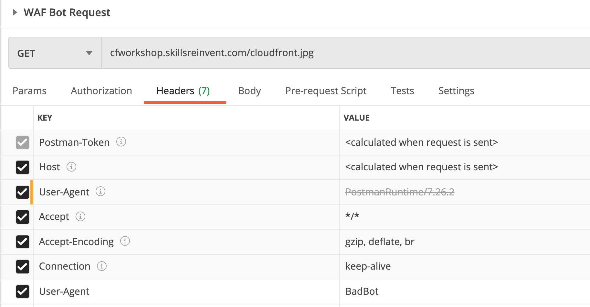
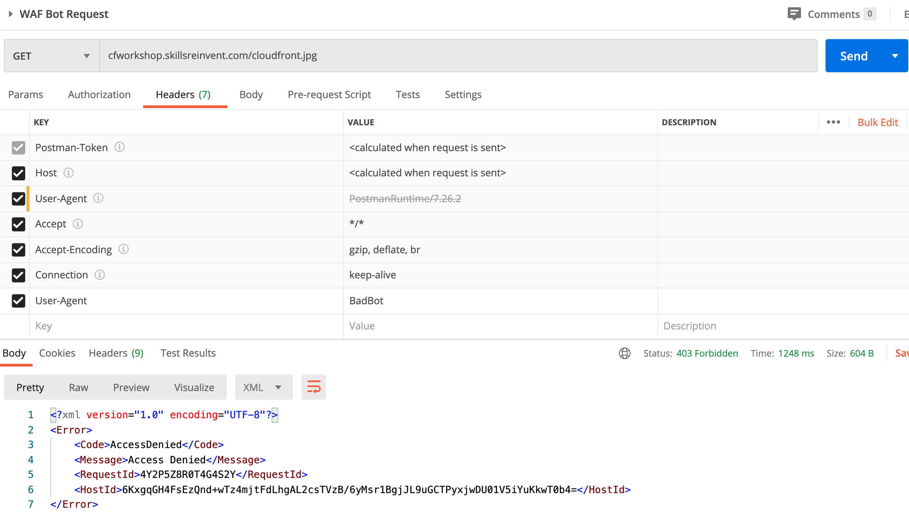

## In this section, we will associate a WAF with the CloudFront distribution

AWS WAF is a web application firewall that lets you monitor the HTTP and HTTPS requests that are forwarded to an Amazon CloudFront distribution, an Amazon API Gateway REST API, or an Application Load Balancer. AWS WAF also lets you control access to your content. Based on conditions that you specify, such as the IP addresses that requests originate from or the values of query strings, API Gateway, CloudFront or an Application Load Balancer responds to requests either with the requested content or with an HTTP 403 status code (Forbidden). You also can configure CloudFront to return a custom error page when a request is blocked.

At the simplest level, AWS WAF lets you choose one of the following behaviors:

- Allow all requests except the ones that you specify

- Block all requests except the ones that you specify

- Count the requests that match the properties that you specify

### How AWS WAF works
You use AWS WAF to control how an Amazon CloudFront distribution, an Amazon API Gateway REST API, or an Application Load Balancer responds to web requests. Key components of WAF:

- Web ACLs – You use a web access control list (ACL) to protect a set of AWS resources. You create a web ACL and define its protection strategy by adding rules. Rules define criteria for inspecting web requests and specify how to handle requests that match the criteria. You set a default action for the web ACL that indicates whether to block or allow through those requests that pass the rules inspections.

- Rules – Each rule contains a statement that defines the inspection criteria, and an action to take if a web request meets the criteria. When a web request meets the criteria, that's a match. You can use rules to block matching requests or to allow matching requests through. You can also use rules just to count matching requests.

- Rules groups – You can use rules individually or in reusable rule groups. AWS Managed Rules and AWS Marketplace sellers provide managed rule groups for your use. You can also define your own rule groups.

After you create your web ACL, you can associate it with one or more AWS resources. The resource types that you can protect using AWS WAF web ACLs are Amazon CloudFront distributions, Amazon API Gateway REST APIs, and Application Load Balancers.

#### Note:- For a CloudFront distribution, AWS WAF is available globally, but you must use the Region US East (N. Virginia) for all of your work. You must create your web ACL using the Region US East (N. Virginia). You must also use this Region to create any other resources that you use in your web ACL, like rule groups, IP sets, and regex pattern sets.

## Scenario steps

### Create a Web ACL
- open the AWS WAF console
- choose Create web ACL.
- For Name, enter **cloudfront-workshop-web-acl**
- For CloudWatch metric name, keep the default name.
- For Resource type, choose CloudFront distributions.
- Region will auto populate with "Global(Cloudfront)
- For Associated AWS resources, choose Add AWS resources. In the dialog box, choose the CloudFront distribution that you want to associate, and then choose Add.
- Choose Next.
### Add a string match rule
- Let's create a string match rule statement.
- On the Add rules and rule groups page, choose **Add rules**, **Add my own rules and rule groups**, **Rule builder**, then **Rule visual editor*.
- For Name, enter **BadBots Requests Check**
- For Type choose Regular rule.
- For **If a request** choose **matches the statement**
- On Statement, for Inspect, choose **Header**
- Header field name = User-Agent
- For Match type, choose **Exactly matches string**
- For **String to Match** enter **WorkshopBot**. AWS WAF will inspect the **User-Agent** header in web requests for the value **WorkshopBot*
- For Action, select the action you want the rule to take when it matches a web request. - For this example, choose **Count**. This creates metrics for web requests that match the rule, but doesn't affect whether the rule is allowed or blocked.
- Choose Add rule.

### Add an AWS Managed Rules rule group
- On the Add rules and rule groups page, choose Add rules, and then choose **Add managed rule groups**.
- expand the listing for the AWS managed rule groups.
- choose **Anonymous IP list** and turn on the Add to web ACL toggle in the Action column. Also turn on the Set rules action to count toggle.
- Choose Add rules
- Choose Next.

### Finish your Web ACL configuration
- On the Add rules and rule groups page, choose Next.
- On the Set rule priority page, choose Next.
- On the Configure metrics page, choose Next.
- On the Review and create web ACL page, review your settings, then choose Create web ACL.

## Test WAF integration with CloudFront Distribution
- We will **Postman** to send HTTP requests to test Lambda@Edge
- Have Postman configured on your laptop
- Open Postman, click "Collections" and click "Import", click Upload Files and select **CloudFront.postman_collection.json**  from **2-lambda-at-Edge/postman-lambda@edge-testharness**
- click on "Collections" and select **WAF Bot Request**
- Look at the headers, there is a **user-agent** header with value **BadBot**

- When you send this request, it will be blocked by WAF and you see the following result

