Test the api vulnerability in your browser. 
- Test api using the following, will give the same results as before
    ```
    https://[your cloudfront distribution domain]/api 
    ```
• Test api using the following, we have appended **?info=dependency;cat%20/etc/passwd** to the api url. The content of content of dependency file and /etc/passwd will be append to the response.

    ```
    https://[your cloudfront distribution domain]/api?info=dependency;cat%20/etc/passwd

    https://d24s77pahd7m46.cloudfront.net/api?info=dependency;cat%20/etc/passwd
    ```

### Vulnerability mitigaton using AWS WAF

- Go to AWS WAF Console, click "Create web ACL"
    - Name: **cloudfront-workshop-webacl**
    - Resource type: **Cloudfront distributions**
    - click **Next**
- On **Add rules and rule groups**, click **Add Rules** and choose **Add my own rules and rule groups**
- Choose Rule type = **Rule builder**
- Rule Name = **Remote-file-inclusion-condition-1**
- Type = **Regular rule**
- If a request = **matches the statement**
- For Statement
    - Inspect = **Single query parameter**
    - Query argument = **info**
    - Match type = **Contains string**
    - String to match = **/**
    - Text transformation = **URL decode**
    - Default Action = **Block**

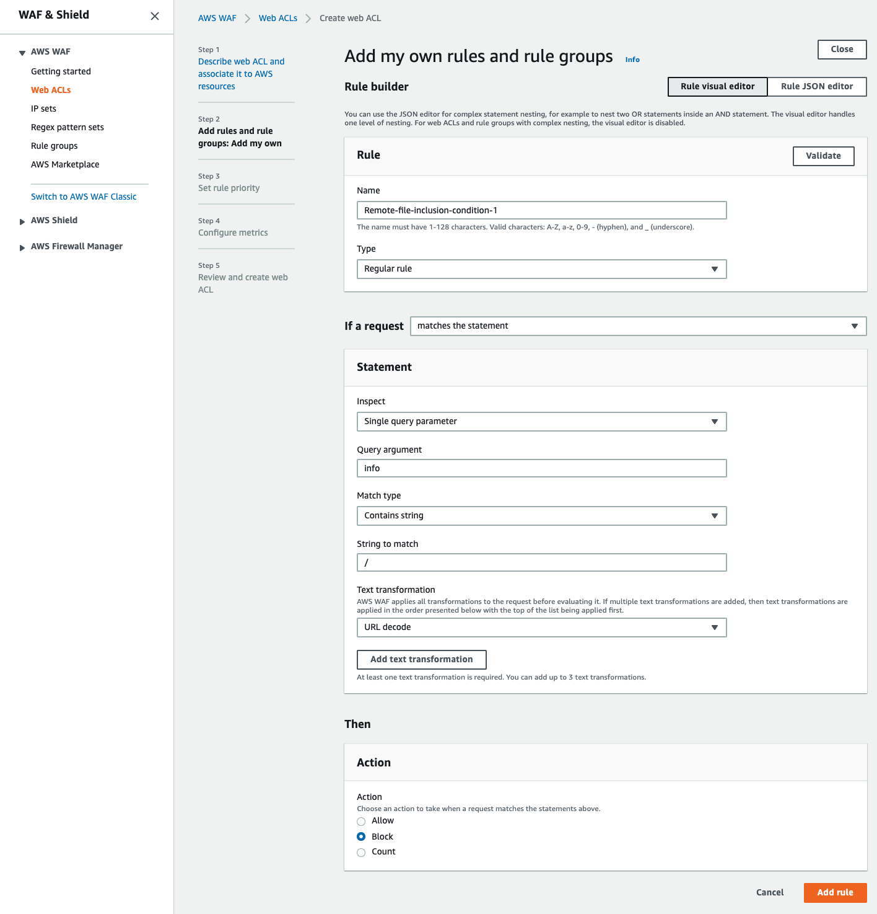

- Add another rule, click **Add Rules** and choose **Add my own rules and rule groups**
- Choose Rule type = **Rule builder**
- Rule Name = **Remote-file-inclusion-condition-2**
- Type = **Regular rule**
- If a request = **matches the statement**
- For Statement
    - Inspect = **Single query parameter**
    - Query argument = **info**
    - Match type = **Contains string**
    - String to match = **;**
    - Text transformation = **URL decode**
    - Default Action = **Block**
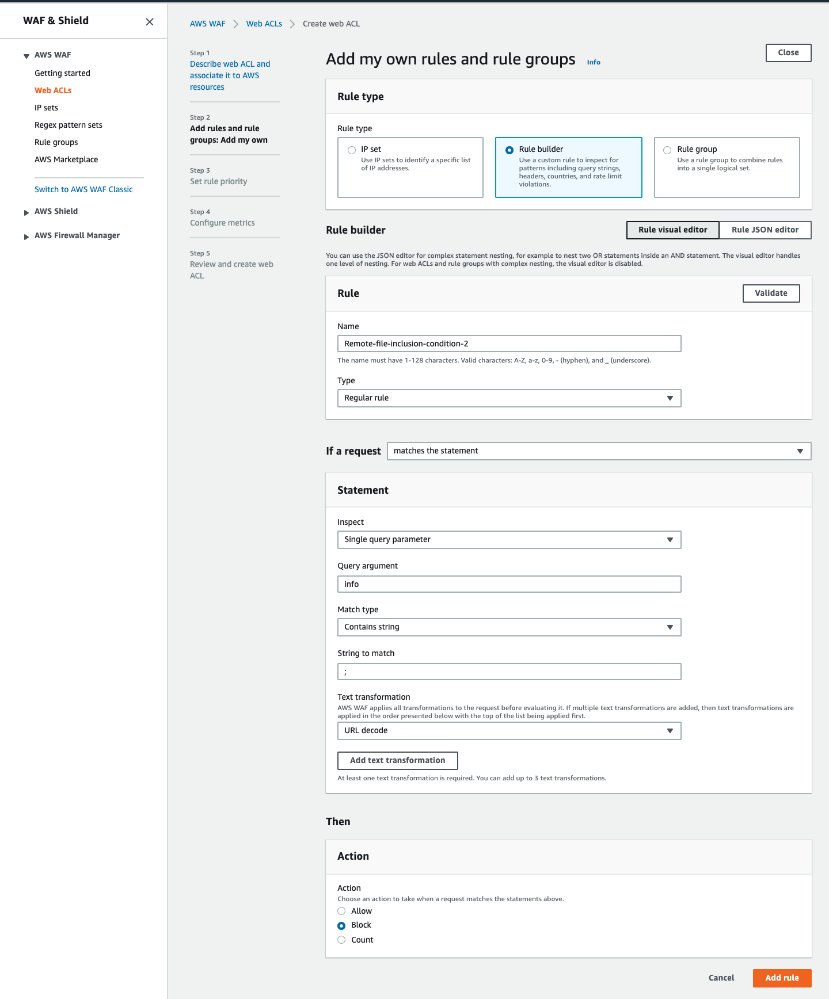

- Default web ACL action for requests that don't match any rules = **Allow**

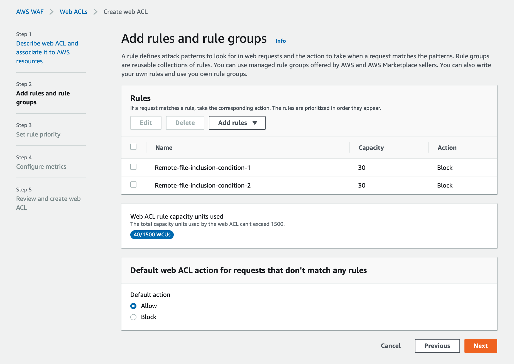

- These conditions that detects / and ; characters in the info query string after decoding as url.

- Click **Next** 
- On **Set rule priority**, click **Next**
- On **Configure metrics**, click **Next**
- On Review and create web ACL, click **Create web ACL**

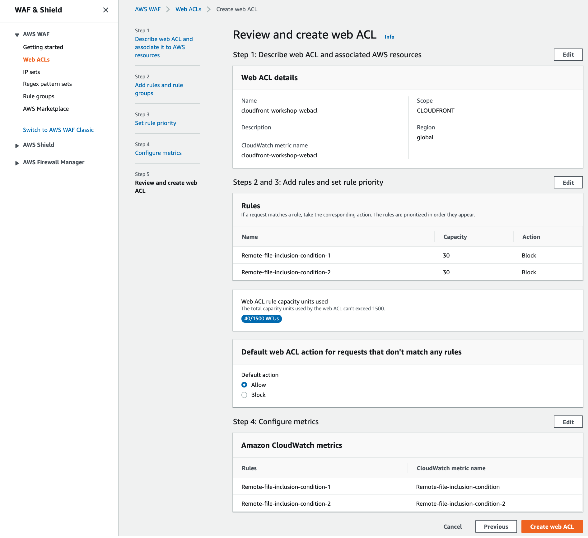

### Associate AWS WAF Web ACL with your CloudFront distribution
- go to CloudFront console and click your CF distribution
- click Edit
- On Edit Distribution, Distribute Settings, for **AWS WAF Web ACL**, select Web ACL that you created in the previous step **cloudfront-workshop-webacl**, click **Yes,Edit**

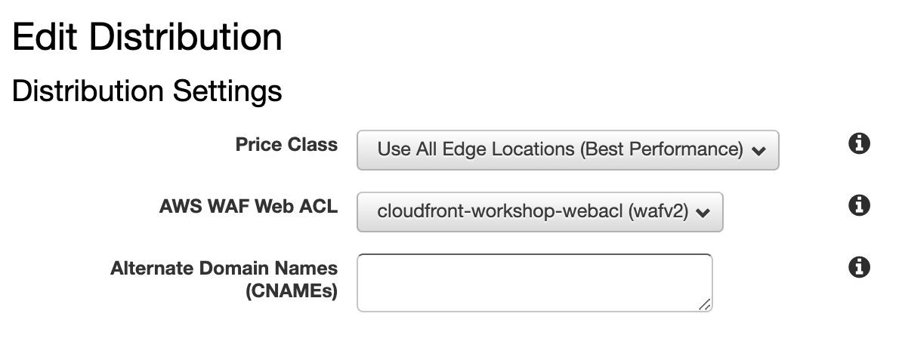

- Make sure you have Customized Error Responses for HTTP Status code 403 Forbidden.

- Once the changes are deployed on your distrubution (status changed to Deployed), you are ready to test AWS WAF WebACL

- Try accessing your api on your CF distribution

```
https://[your cloudfront distribution domain]/api?info=dependency;cat%20/etc/passwd
```
- You should see customized 403 Forbidden error page.

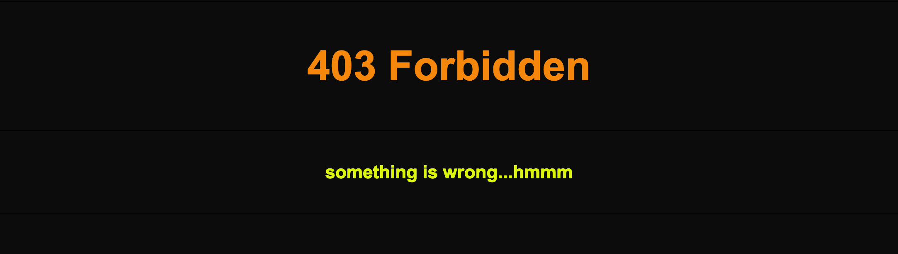

- Finally, go to your newly created WebACL in the AWS WAF console and check the sampled requests. It takes a couple of minutes to pop up on the console. You will see the details of the requests that were blocked by WAF.

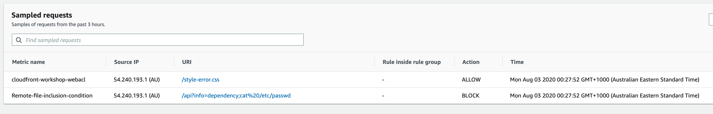

- sampled request detail

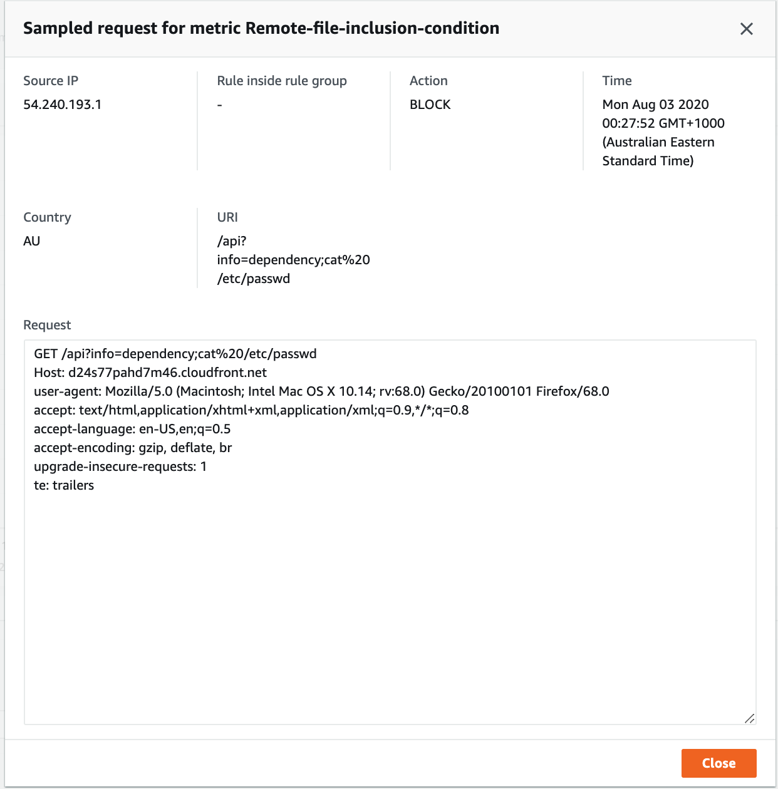


## Automation honeypot

In this section, you will implement a honeypot that catches and block bad bots using AWS WAF automation capabilities and other AWS services. In fact, you will create a honeypot endpoint using API Gateway and Lambda. This endpoint will be banned using Robot.txt. The robots.txt file is a simple text file placed on your origin which tells webcrawlers like Googlebot if they should access a file or not. In general, bad bots will not honor robot.txt, and scrape the endpoint. When it happens, a Lambda function is triggered and used to block the bad bot IP in AWS WAF automatically.

- Go to AWS WAF Security Automations and deploy CloudFormation stack

[AWS WAF Security Automations](https://docs.aws.amazon.com/solutions/latest/aws-waf-security-automations/deployment.html#step1)

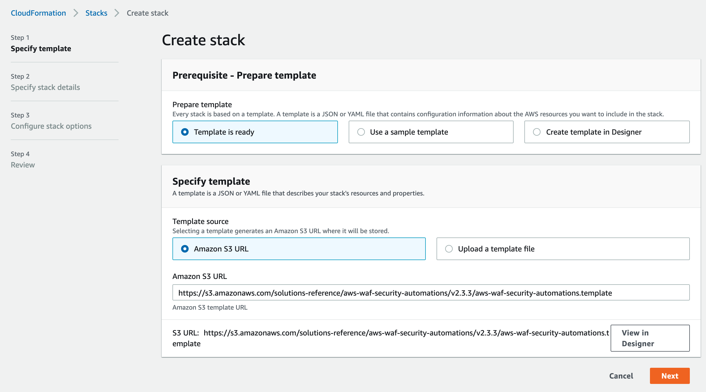

- seelct **Yes** only for **Activate Bad Bot Protection**

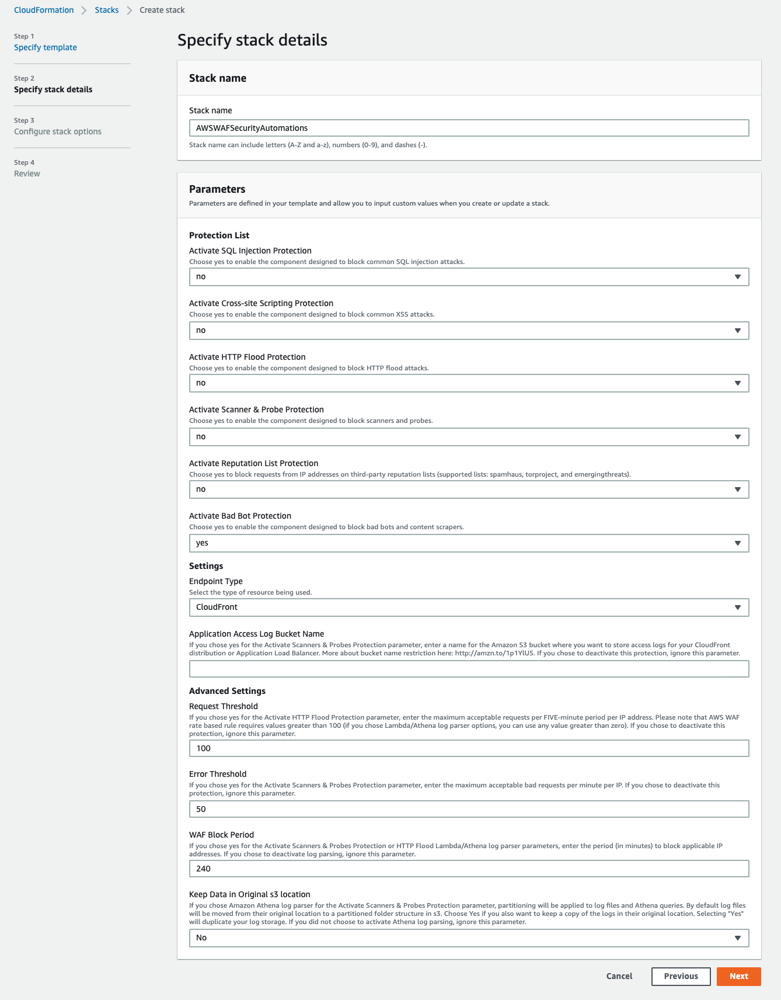

- Click Next, allow CloudFormation to use the permissions required to create resources and create stack.

- The deployment takes a couple of minutes to finish. When the status of the stack is CREAT_COMPLETE, check the output tab and note the URL of the honey pot as well as the name of the WAF Web ACL.

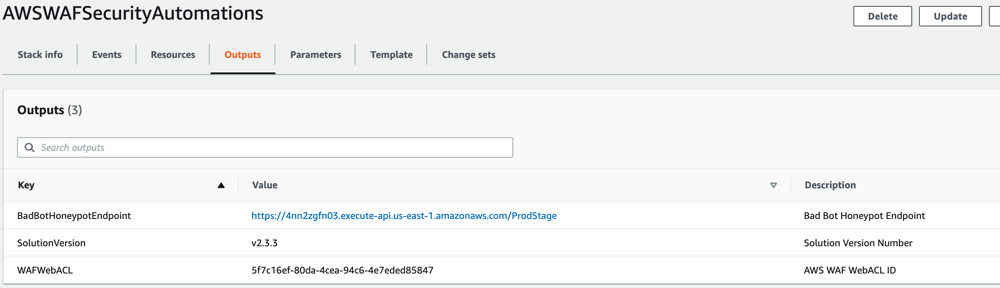

- Note: Cloudformation stack creates a WebACL in **AWS WAF Classic**

- Go to CloudFront console and create a new origin in your previously created distribution. **Use the honeypoint URL** noted in the previous step. Make sure to select **HTTPS as origin Protocol policy**.

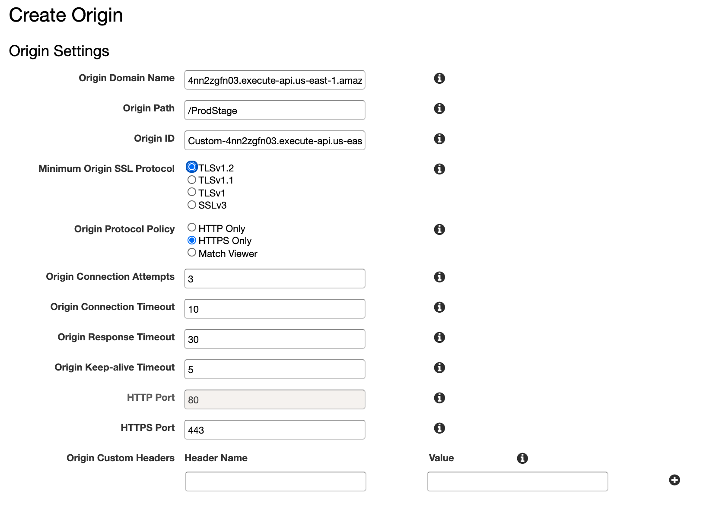

- Next create a new behaviour using this origin, and with **/honeypot** path pattern. Make sure to Customize Object Caching, and use Zero value in all TTLs.

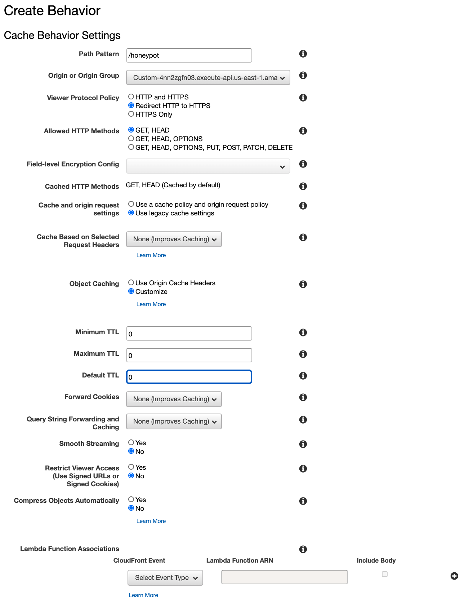

- Associate your distribution to the WAF Web ACL created by the CloudFormation template.

- Normally, you need to modify the robots.txt file in the root of your website to explicitly disallow the honeypot link, as follows as described in solution documentation. For the sake of simplicity, you will skip this part.

[Embed the Honeypot Link in Your Web Application](https://docs.aws.amazon.com/solutions/latest/aws-waf-security-automations/deployment.html#step3)

- Test your api URL, it should be working normally.


- Using your browser, trigger the honeypot using URL: https://[your cloudfront distribution domain]/honeypot. You will get the below message with your own IP.

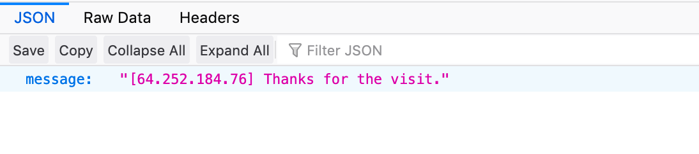

- Go to AWS WAF console, and check that your IP is automatically added in the BAD Bot set.

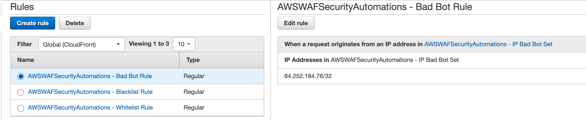


- Try to load your api URL again, you will be blocked and you will see the custom error page by CloudFront.


     
