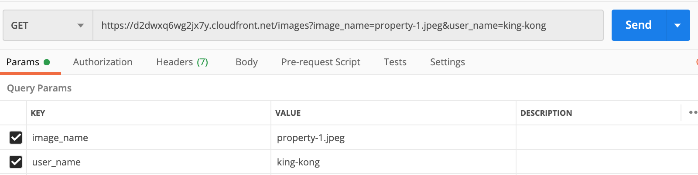

## Private Content With Signed URL

### Introduction
This is what we will build here


### Prerequisites
- You need to have a root access to AWS account to create CloudFront key to generate pre-signed url.
- Generate a CloudFront key, download the private key and store it in AWS Secret manager
  - secret name must be **cloudfrontkey**
- Store CloudFront Access Key Id in the parameter store (Systems Managers), 
Take note of CloudFront Access Key Id and secret name that you use to store CloudFront private key in the secret manager.
- Create an EC2 instance, select Amazon Linux 2
- Assign it an admin role as we will deploy this from EC2 due to a constraint with cryptography library that we are using to generate pre-signed url
- Login into EC2 instance and install git
```
$ sudo yum install git
```
- Install Python 3.7
```
$ sudo yum install python37
```
- Clone this repository
```
$ git clone https://github.com/vikasbajaj/cloudfront-workshop.git
```

- change directory to cloudfront-workshop/8-serving-private-content-with-signed-URLs-and-signed-cookies and run the following

```
$ source vars.env
```
- change directory LambdaFunction 

  - replace xxxxxxxxxx for secret_name with the secret name that you store in AWS Secret manager to store your CloudFront private key.

  - replace xxxxxxxxx for key_id with the CloudFront key name

- Deploy stack using the following

````
$ ./deploy.sh deploy
````

- Once deployed, open the Postman test harness and run "Access Premium Property Images" request as shown in the image below

- Note: there are two request params that we are passing
  - image_name=property-1.jpeg
  - user_name=vik


- You should see **You are trying to access premium property images, you need to subscribe for premium membership** message as shown in the image below.


- Now we will resend the request with a user name who has (let's assume) got the premium membership
- change the user name to **king-kong** (pls don't ask me why this name :-) )
  - image_name=property-1.jpeg
  - user_name=king-kong

- As shwon below in the image



- you should see a response returing **Pre-Signed URL** as you accessed the image with a paid user name, as shown below


- Copy presigned URL and open another tab in Postman or your browser and paste the presigned url


#### Isn't it cool?

_**However, there is an issue with this implementation**_

#### Your API is still accessible directly and if API url is known, anyone can access the your APIOrigin api directly bypassing your CloudFront Distribution.

- Let's check

- Try to access the APIOrigin api directly
- Go to API Gateway, select Stages in the left menu, click on **demo**
- copy url
- Open a new tab in Postman and access the following url

```
<Demo Stage API Url>/images?image_name=property-1.jpeg&user_name=king-kong
```
- You will see that you get the Presigned URL for the image that you are trying to access.
- Same result as you received from your CloudFront Distribution.

### Let's secure the APIOrigin api

- Undeploy the stack, you should be in 8-serving-private-content-with-signed-URLs-and-signed-cookies directory

```
$ ./deploy.sh delete
```
- Deploy another stack

```
$ ./deploy-custom-authorizer.sh deploy
```

- Now try access APIOrigin api directly
- You won't be able to access the underlying directly.

#### This is cool, isn't it...:-)


